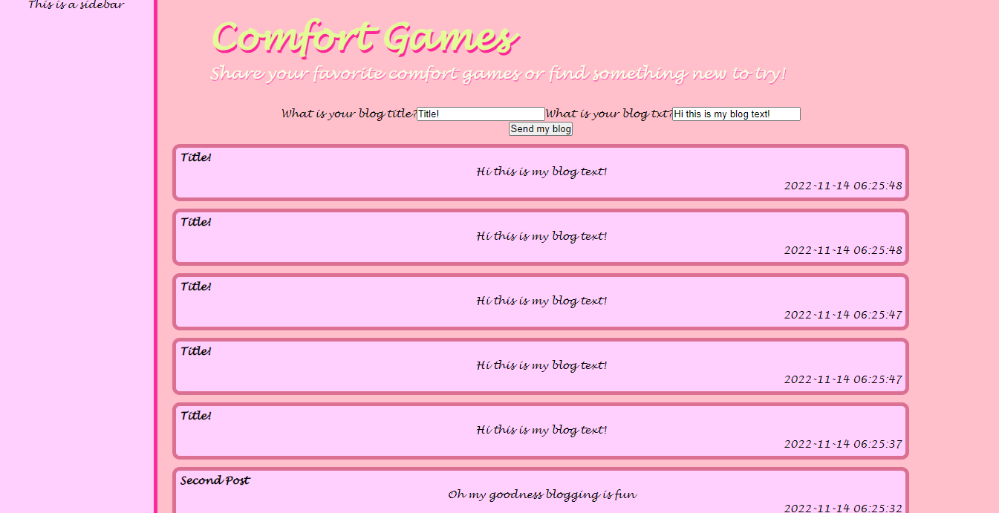
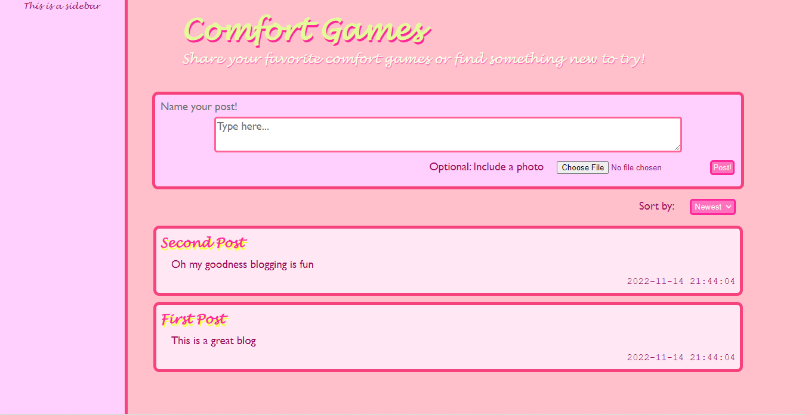
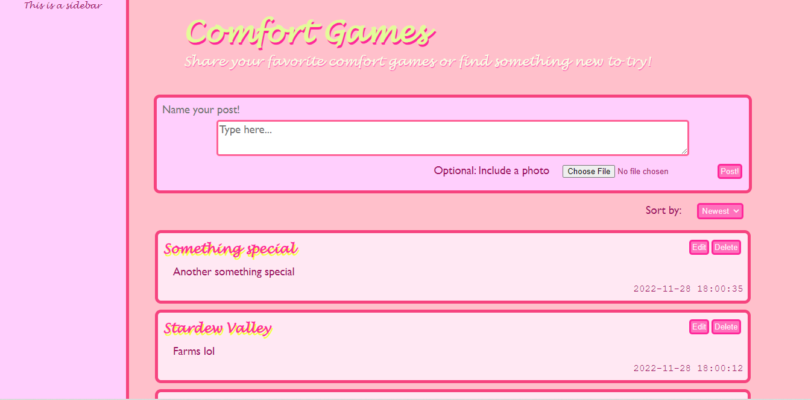

# Comfort Games Blog

## Week One
I had a little bit of trouble getting myself to start week one, but I was able to quickly come up with the idea for the design.

<embed src="my-design.pdf" height=500 alt="Design Layout">

Sunday I decided to take a crack at actually implementing the designed website, and I had a lot of fun. I was also able to figure out <i>some</i> of the database stuff. Not including how to stop sql injection, but everything basic. And I was able to add automatic time stamps and sort the posts in reverse order.

## Week Two
It's just monday but I'm already feeling really motivated to get this website looking like something I'm proud of, so here's my current update on the website

## Over break
I just realized I had an incorrect timeline in my head and that I'm late on the edit feature. Problem is, I can't figure out for the life of me how to implement it. still honestly not sure what to do yet.

## Update and Delete Functions

- Update and delete: 
I figured out how to implement the update and delete functions. It worked exactly as expected except I was meant to do req.body.name, but I thought I need to do req.blog.name. So, I got it to work! There is also the option to cancel an edit if you do not wish to change it. Delete currently does not ask for confirmation and simply deletes an entire blog entry.
- New blog at top requires not-empty fields. Previously, you could spam the post button and clog the blog with numerous empty blogs. Now, they are required and won't allow empty posts.
- Current Goals:
    - Allow photos to be inserted into posts
    - ~~Make the sort button work :)~~
    - Refresh with an edit open OR ~~clicking edit on a new post~~ should close any other posts from editing.
    - Make the sidebar more visually interesting. It has been abandoned.
    - It would be nice if i could get the page to remember the scroll location on refresh
    - If I still have time, add ~authentication~

