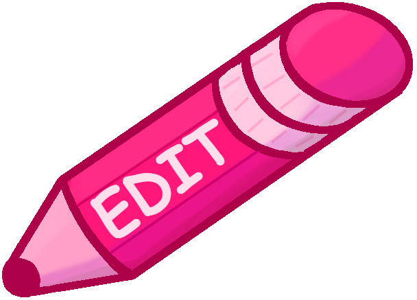

# Comfort Games Blog

## Week One
I had a little bit of trouble getting myself to start week one, but I was able to quickly come up with the idea for the design.

<embed src="my-design.pdf" height=500 alt="Design Layout">

Sunday I decided to take a crack at actually implementing the designed website, and I had a lot of fun. I was also able to figure out <i>some</i> of the database stuff. Not including how to stop sql injection, but everything basic. And I was able to add automatic time stamps and sort the posts in reverse order.

## Week Two
It's just monday but I'm already feeling really motivated to get this website looking like something I'm proud of, so here's my current update on the website

## Over break
I just realized I had an incorrect timeline in my head and that I'm late on the edit feature. Problem is, I can't figure out for the life of me how to implement it. still honestly not sure what to do yet.

## Update and Delete Functions

- Update and delete: 
I figured out how to implement the update and delete functions. It worked exactly as expected except I was meant to do req.body.name, but I thought I need to do req.blog.name. So, I got it to work! There is also the option to cancel an edit if you do not wish to change it. Delete currently does not ask for confirmation and simply deletes an entire blog entry.
- New blog at top requires not-empty fields. Previously, you could spam the post button and clog the blog with numerous empty blogs. Now, they are required and won't allow empty posts.
- Current Goals:
    - Allow photos to be inserted into posts
    - ~~Make edit and trash buttons cute icons~~
    - ~~Make the sort button work :)~~
    - Refresh with an edit open OR ~~clicking edit on a new post~~ should close any other posts from editing.
    - Make the sidebar more visually interesting. It has been abandoned.
    - It would be nice if i could get the page to remember the scroll location on refresh
    - If I still have time, add ~authentication~

## Finishing Touches
Because the semester is nearing a close, and my website is currently very lovely to look at, I think I have found a good stopping point. So I am halting work, unfortunately(this has been the only final project I enjoy working on), so that I can focus my attention elsewhere.

### The finishing touches I added include: 
- A logo in the sidebar:
- 
- A cute edit button  
- A cute delete button  

Retrospectively, I shouldn't have detailed the buttons so much or added text. You can't see that much when they are 30pt.

### The Finished Product

An example of the edit button working as intended :)

### What I would have loved to add, had I had the time
 - User-based Authentication
 - Images in the posts
 - Use cookies to remember scroll position
 - Have the selected option on the sort-by drop down reflect the current sorting method(it always resets to Newest) 
 - Javascript and CSS to add hover and onclick events to give it that interactive feel.
 - Edit's close on page refresh
 - More pages to click to through the side bar
 - Quiet music in the background
 - Make it so the cancel button can cancel if contents are empty

 ## Notes about the Class

Professor Panter, I love this class. But I also love the concept of website design. I feel as though the course work and materials were well aligned up until about week seven. The Typescript project was very difficult. We were expected to write about using typescript for someone who understood javascript, which we did not as that was the reading material for the few weeks the project was assigned. I feel like because of this, most of the students were more focused on writing up this website than learning about javascript. I myself regret getting almost no practice in javascript this semester. Further, I meant it when I said the reading was simply too much to handle. I know many people just do the activities, but assigning insane amounts of reading can encourage those who do want to read to just do the participation activities and get the points. The participation points are actually a really great measure of how difficult a reading will be. Long story short, I wish the assignments were better aligned with the readings during the second half of class. Now that that's all out of the way: the class is so fun. I spent so many hours doing independent research in this class, I cared enough about this class to learn on my own how to build and design websites. You're a wonderful and kind professor, and you're extremely gracious when it comes to grading. I genuinely enjoyed what I got to learn and create in this class. I hope it continues to be taught, and I hope that my notes can make it a more enjoyable class for other students in the future.

I know this can all go in an evaluation, but I'll do both. I wanted you to know how I felt.